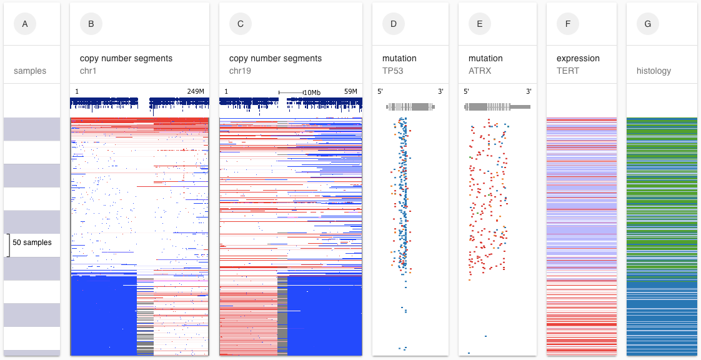

[[contentHero]]
| Welcome to the next generation UCSC Cancer Browser: UCSC Xena!

UCSC Xena has all the same functionality of the UCSC Cancer Browser plus new tools, such as the ability to see multiple types/modes of genomic data side-by-side, and plenty of new data, such as the latest from the GDC, GTEx and more.

New to Xena? Get started with the [tutorials](https://ucsc-xena.gitbook.io/project/tutorials) or [jump right in](https://xenabrowser.net/heatmap/)!

UCSC Xena can also be used to view your own functional genomics data. Get started [here](https://ucsc-xena.gitbook.io/project/local-xena-hub/getting-started)!

Questions? Contact us via our [public forum](https://groups.google.com/forum/#!forum/ucsc-cancer-genomics-browser) or [private mailing list](mailto:genome-cancer@soe.ucsc.edu).
